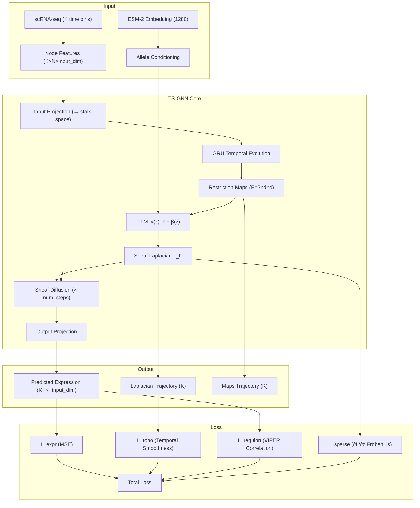
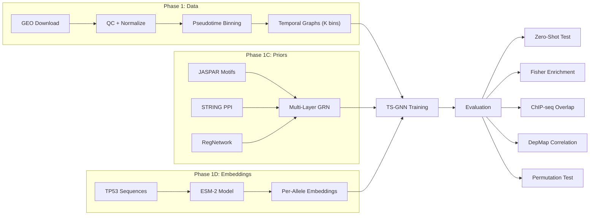
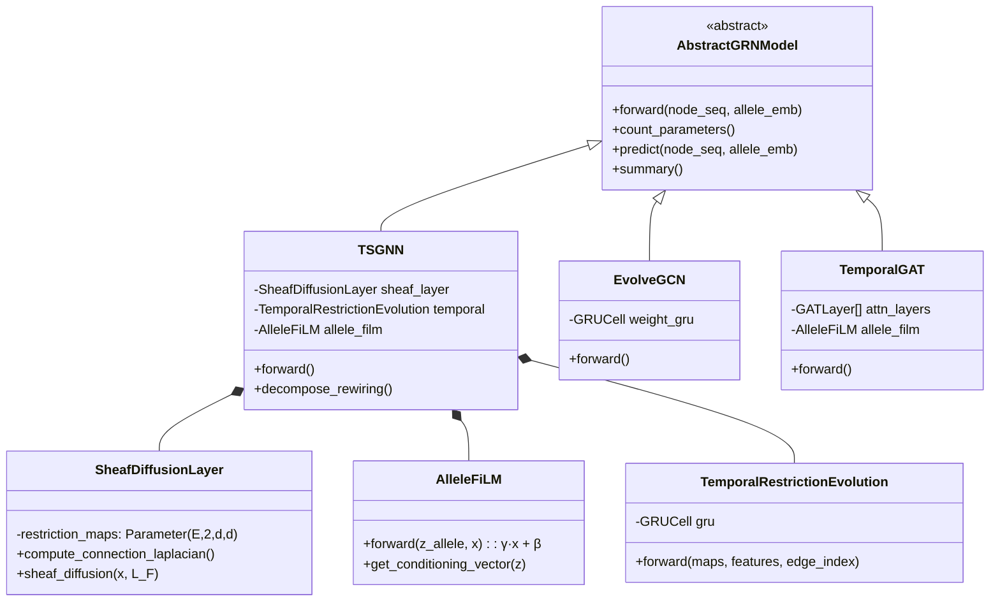

# TS-GNN Architecture

## System Overview



## Data Flow Pipeline



## Component Interactions



## Key Design Decisions

### 1. FiLM vs Hypernetwork

**Chosen: FiLM** — Feature-wise Linear Modulation

| | FiLM | Hypernetwork |
|---|---|---|
| Parameters | O(k) — 2 vectors per allele | O(k·p) — full weight matrix |
| Expressivity | Per-element scaling + shift | Arbitrary weight generation |
| Stability | Identity init (γ=1, β=0) | Hard to initialize stably |
| Interpretability | γ shows which dimensions matter | Black box |

**Rationale:** FiLM is sufficient because allele conditioning modulates *existing* restriction map dynamics rather than generating entirely new ones. The identity initialization ensures the model starts with the context-only Laplacian and learns allele-specific perturbations incrementally.

### 2. Stalk Dimension d=4

- d=1: reduces to standard graph Laplacian (no sheaf benefit)
- d=2: minimal sheaf structure, may underfit heterophily
- **d=4: good balance** of expressivity (16 params per map) and efficiency
- d=8: 64 params per map, Laplacian is (4000×4000) for N=500

### 3. Sparsity Loss via Autograd

The sparsity loss ‖∂L_F/∂z_allele‖_F penalizes the norm of the Jacobian of the Laplacian w.r.t. the allele embedding. This is computed via:

```python
grad = torch.autograd.grad(L_F.sum(), allele_embedding, create_graph=True)
sparsity = grad[0].norm()
```

This enforces **k-hop locality**: the allele-specific perturbation should affect only a local neighborhood, not the entire Laplacian.
